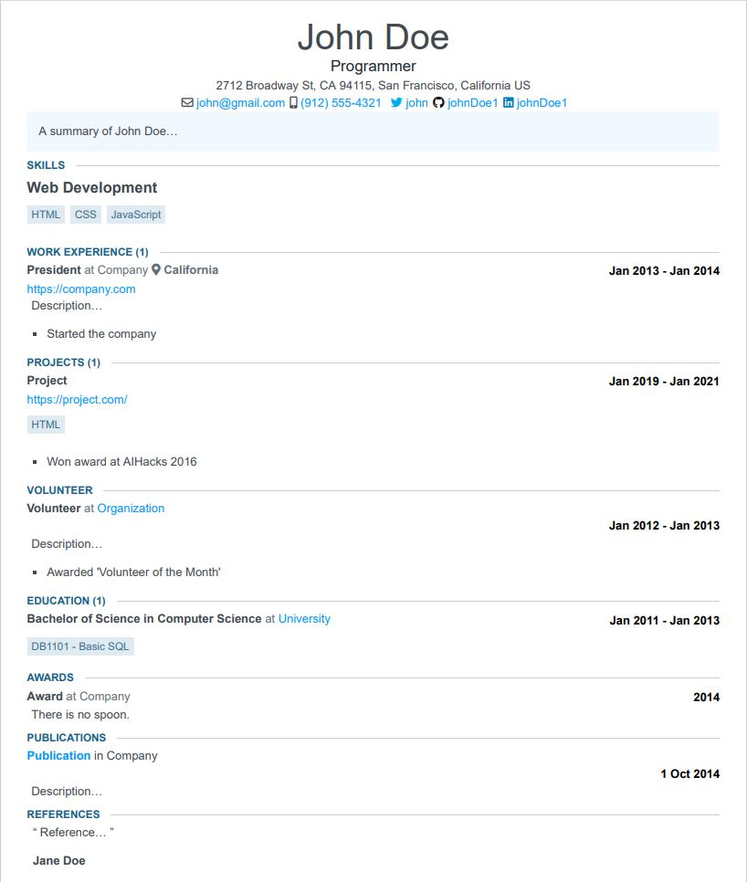

# Slickoverflow Theme for Jsonresume 

> A variation of jsonresume-theme-stackoverflow.

## Demo



# Getting Started

## Install the jsonresume CLI

```
npm install -g resume-cli
```

## Install the slickoverflow theme

```
npm install jsonresume-theme-slickoverflow

or

npm install https://github.com/adavila0703/jsonresume-theme-slickoverflow
```

## Create Schema

Use the following command to initialize a resume.json file.

```
resume init
```

Store the following json schema in your resume.json file.

```json
{
    "basics": {
        "name": "John Doe",
        "label": "Programmer",
        "email": "john@gmail.com",
        "phone": "(912) 555-4321",
        "url": "https://johndoe.com",
        "summary": "A summary of John Doe…",
        "location": {
            "address": "2712 Broadway St",
            "postalCode": "CA 94115",
            "city": "San Francisco",
            "countryCode": "US",
            "region": "California"
        },
        "profiles": [
            {
                "network": "Twitter",
                "username": "john",
                "url": "https://twitter.com/john"
            },
            {
                "network": "GitHub",
                "username": "johnDoe1",
                "url": "https://github.com"
            },
            {
                "network": "LinkedIn",
                "username": "johnDoe1",
                "url": "https://linkedin.com"
            }
        ]
    },
    "work": [
        {
            "name": "Company",
            "position": "President",
            "location": "California",
            "url": "https://company.com",
            "startDate": "2013-01-01",
            "endDate": "2014-01-01",
            "summary": "Description…",
            "highlights": [
                "Started the company"
            ]
        }
    ],
    "volunteer": [
        {
            "organization": "Organization",
            "position": "Volunteer",
            "url": "https://organization.com/",
            "startDate": "2012-01-01",
            "endDate": "2013-01-01",
            "summary": "Summary…",
            "highlights": [
                "Awarded 'Volunteer of the Month'"
            ]
        }
    ],
    "education": [
        {
            "institution": "University",
            "url": "https://institution.com/",
            "area": "Computer Science",
            "studyType": "Bachelor of Science",
            "startDate": "2011-01-01",
            "endDate": "2013-01-01",
            "courses": [
                "DB1101 - Basic SQL"
            ]
        }
    ],
    "awards": [
        {
            "title": "Award",
            "date": "2014-11-01",
            "awarder": "Company",
            "summary": "There is no spoon."
        }
    ],
    "publications": [
        {
            "name": "Publication",
            "publisher": "Company",
            "releaseDate": "2014-10-01",
            "url": "https://publication.com",
            "summary": "Summary…"
        }
    ],
    "skills": [
        {
            "name": "Web Development",
            "keywords": [
                "HTML",
                "CSS",
                "JavaScript"
            ]
        }
    ],
    "references": [
        {
            "name": "Jane Doe",
            "reference": "Reference…"
        }
    ],
    "projects": [
        {
            "name": "Project",
            "highlights": [
                "Won award at AIHacks 2016"
            ],
            "keywords": [
                "HTML"
            ],
            "startDate": "2019-01-01",
            "endDate": "2021-01-01",
            "url": "https://project.com/"
        }
    ]
}
```

## Export command

#### Windows

```
resume export -f pdf -t .\\node_modules\\jsonresume-theme-slickoverflow\\ resume.pdf
```
#### Mac 

```
resume export -f pdf -t ./node_modules/jsonresume-theme-slickoverflow/ resume.pdf
```


